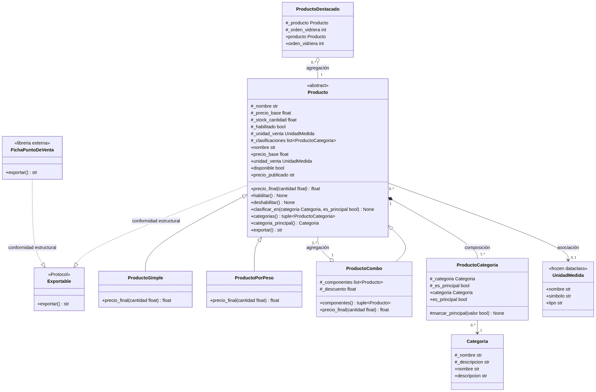
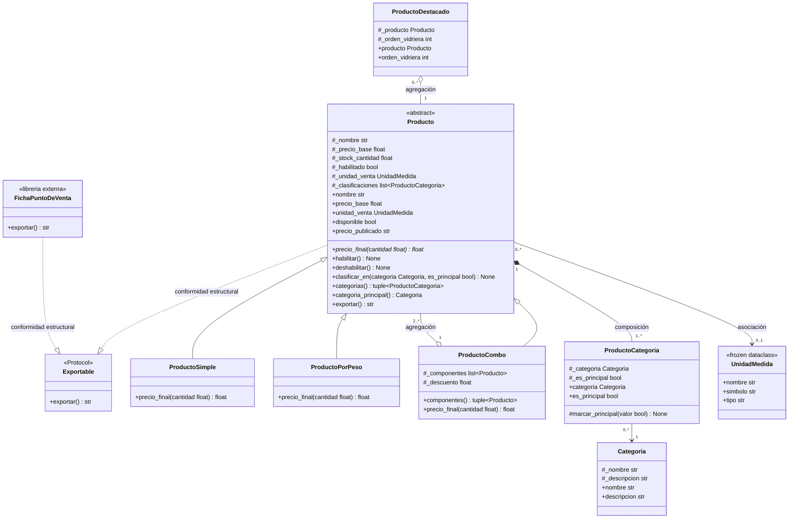

# Diagrama de Clases UML — Modelo Final

Diagrama de clases del modelo de dominio del catálogo de **Food Store**, actualizado según las decisiones de diseño del **Requerimiento 3** y las especificaciones del parcial de Programación IV.

---

## Representación Gráfica

---

## Código Mermaid

---

## Fundamentación y Coherencia con el Código (`catalogo.py`)

### 1. Resolución de `ProductoDestacado` (Requerimiento 3 / HU-P1-05)
* **Decisión sobre la herencia:** Se descartó la relación de herencia del diagrama inicial (`Producto <|-- ProductoDestacado`).
* **Justificación de dominio («es-un»):** Un producto destacado **no es un nuevo tipo de producto** con una regla de cálculo de precio propia (a diferencia de `ProductoSimple`, `ProductoPorPeso` o `ProductoCombo`). «Destacado» representa un estado o rol promocional temporal para exhibición en vidriera con un orden determinado (`_orden_vidriera`). Mantener la herencia obligaría a subclasificar o usar herencia múltiple para poder destacar productos por peso o combos.
* **Rediseño implementado — Agregación (`o--`):**
  * `ProductoDestacado` agrega a un `Producto` existente (`#_producto: Producto`), el cual es necesario para su instanciación y es recibido ya construido desde el exterior en su constructor (`self._producto = destacado`).
  * **Ciclo de vida desacoplado:** El `Producto` existe con anterioridad e independencia del objeto `ProductoDestacado`, y si el destacado deja de existir en vidriera, el producto sigue existiendo en el catálogo.
  * Expone las properties de solo lectura `producto` y `orden_vidriera`.
  * Permite destacar **cualquier producto del catálogo** (simples, por peso o combos) de manera uniforme y sin forzar la jerarquía de herencia.

### 2. Relaciones Estructurales (Requerimiento 2 / HU-P1-02)
* **Composición (`Producto "1" *-- "1..*" ProductoCategoria`):** La relación de clasificación es fabricada exclusivamente por el propio `Producto` (`clasificar_en`). El código cliente no instancia ni reemplaza `ProductoCategoria`. El ciclo de vida del vínculo depende enteramente del producto.
* **Agregación (`ProductoCombo "1" o-- "2..*" Producto`):** Los productos componentes se reciben ya construidos. Tienen ciclo de vida independiente del combo (existen antes y después de este).
* **Asociación (`Producto "0..*" --> "0..1" UnidadMedida`):** La unidad de medida es opcional e inmutable (`frozen dataclass`). Existe independientemente del producto.
* **Asociación (`ProductoCategoria "0..*" --> "1" Categoria`):** Cada vínculo de clasificación apunta a una `Categoria` existente del catálogo.

### 3. Contrato Estructural (`Exportable`) (Requerimiento 4 / HU-P1-04)
* `Exportable` está definido como `Protocol` con el método `exportar() -> str`.
* Tanto `Producto` como `FichaPuntoDeVenta` cumplen el contrato por **conformidad estructural** (duck typing tipado, notación `..|>`), sin heredar de `Exportable`, preservando intacta la `libreria_externa.py`.
